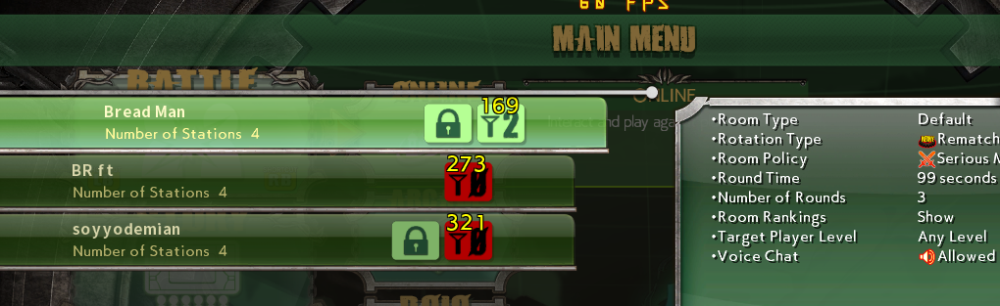
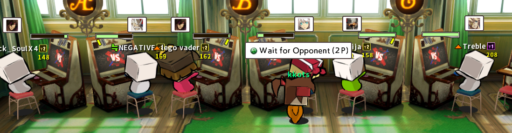

# GGXrdDisplayPing

For Guilty Gear Xrd Rev2 version 2211. Adds ping displays

...on the Lobby List:  


...on the Member List:  


... under players' connection tier icons inside a lobby:  


Works as of 2025 March 3.

## Credits

Big thanks to WorseThanYou (@worsety) for finding the function that draws player names in the lobbies!

## How to use

For Windows:

Download the .zip file from the Releases section and extract it. In any order, launch the game and `GGXrdDisplayPingInjector.exe`, then into GGXrdDisplayPingInjector.exe's window type `y` and hit Enter. Hit Enter again to close it.

For Linux:

Download the .zip file from the Releases section and extract it. Give yourself permission to launch the script:

```bash
chmod u+x launch_GGXrdDisplayPingInjector_linux.sh
```

In any order, launch the game and the `.sh` script:

 ```bash
 ./launch_GGXrdDisplayPingInjector_linux.sh
 ```
 
 In the console window, type `y` and hit Enter. Hit Enter again to end the program.

Uninjection does not work on Linux for unknown reason.

## Patching the game to always launch with the mod

Windows/Linux:

Instead of a patcher, you can add the injector into the game's .bat file.

1) Navigate to the game's installation directory, usually in `C:\Program Files (x86)\Steam\steamapps\common\GUILTY GEAR Xrd -REVELATOR-\`.
2) Open `BootGGXrd.bat` using Notepad.
3) Place the text cursor at its very end, on a new line, and put `GGXrdDisplayPingInjector.exe -force` into it.
4) Save and close the file.
5) Copy and paste the `GGXrdDisplayPingInjector.exe` and `GGXrdDisplayPing.dll` files into the game's `\Binaries\Win32\` folder.

When the game launches, it will now also launch the mod.

On Linux, the game usually can be found in `~/.steam/root/steamapps/common/GUILTY GEAR Xrd -REVELATOR-/`.

## Changelog

2025 March 4: Version 1.1: Made changes to the injector to reduce the risk of being flagged as malware by Windows Defender. Made 64-bit injector work (was not working previously).

2025 March 8: Version 1.2: Removed the command-line version of the injector and replaced it with a desktop window based version, in order to trigger Windows Defender less often.

2025 October 30: Version 1.3: Fixed a crash in the Xrd process that happens due to memory holding the "GGXrdDisplayPing.dll" string being freed by the injector too early.