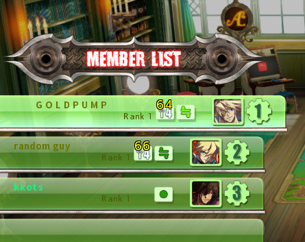

# GGXrdDisplayPing

For Guilty Gear Xrd Rev2 version 2211. Adds ping displays

...on the Lobby List:  


...on the Member List:  


... under players' connection tier icons inside a lobby:  


Works as of 2025 March 3.

## How to use

For Windows:

Download the .zip file from the Releases section and extract it. In any order, launch the game and `GGXrdDisplayPingInjector.exe`, then into GGXrdDisplayPingInjector.exe's window type `y` and hit Enter. Hit Enter again to close it.

For Linux:

Download the .zip file from the Releases section and extract it. Give yourself permission to launch the script:

```bash
chmod u+x launch_GGXrdDisplayPingInjector_linux.sh
```

In any order, launch the game and the `.sh` script. In the console window, type `y` and hit Enter. Hit Enter again to end the program.

Uninjection does not work on Linux for unknown reason.

## Patching the game to always launch with the mod

Windows/Linux:

Instead of a patcher, you can add the injector into the game's .bat file.

1) Navigate to the game's installation directory, usually in `C:\Program Files (x86)\Steam\steamapps\common\GUILTY GEAR Xrd -REVELATOR-\`.
2) Open `BootGGXrd.bat` using Notepad.
3) Place the text cursor at its very end, on a new line, and put `GGXrdDisplayPingInjector.exe -force` into it.
4) Save and close the file.
5) Copy and paste the `GGXrdDisplayPingInjector.exe` and `GGXrdDisplayPing.dll` files into the game's `...\Binaries\Win32\` folder.

When the game launches, it will now also launch the mod.

On Linux, the game usually can be found in `~/.steam/debian-installation/steamapps/common/GUILTY GEAR Xrd -REVELATOR-/`.
